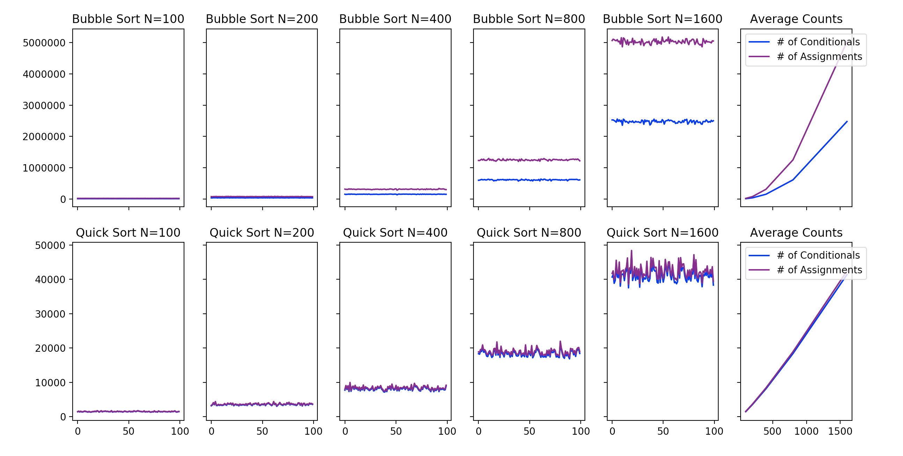

# HW 1
##### Christa Caggiano
##### 26 Jan 2018

## Number of Conditionals and Loops

**Plots 1-5:** Number of assignments and conditionals for 100 randomly generated vectors of size _n_. 

**Plot 6:** Average number of assignments and conditionals for each vector size. 

## Complexity

My **Bubble sort** algorithm is O(n2) because each item in the list is accessed once in the for loop = *N* times. 
If the list was completely sorted, the best case, the loop will finish and the run time would be O(n). 
In the worst case, a completely unsorted list (ex l = [5, 4, 3, 2, 1]) the algorithm will need to go through the list *N* 
times in the original loop, where the 5 will bubble up. Next, bubble sort will go through the loop again until 4 bubbles up. 
This will continue for each number in the list, a total of *N* times. This leads to a total runtime of O(n2).
This is illustrated in the above graph in the average plot, where the purple line increases approximately n2 
as the number of items in the vector increases. 

**Quick sort** is O(n log(n)) because the original transversal of the list is *N*, needed to partition the list into two lists. 
With each recursive step my algorithm takes, however, the size of the list the algorithm traverses is halved, meaning each 
subsequent step in log(n). Thus, the overall average complexity is O(n log(n)). This is roughly illustrated in the above graph where 
the number of assignments is slightly steeper than linear. 

## Github Repo

https://github.com/christacaggiano/Sorting-Functions

## Travis Build

https://github.com/christacaggiano/Sorting-Functions